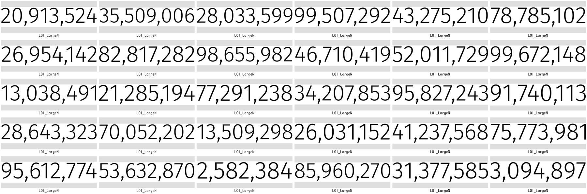

# LaGuardiaELJ101Asynch
- Resources for a fully-asynchronous elementary-level Japanese class (ELJ101) at LaGuardia Community College

## Images
- These images were generated with generative AI tools for asynchronous materials. The following AI tools were used for images:
	- Google Imagen (https://deepmind.google/models/imagen/)
	- OpenAI Dall-e (https://openai.com/index/dall-e-3/)
- Some, but not all, images are used as part of the practice sets.

## Thumbnails
- あいさつ

- Numbers

- Self-introduction

- Large Numbers

- こそあど

- Verbs

- あります/います

## License
- This work is licensed under a CC BY-NC-SA 4.0 [Creative Commons Attribution-NonCommercial-ShareAlike 4.0 International License](https://creativecommons.org/licenses/by-nc-sa/4.0/). Feel free to use any resources on this page for your own purposes as long as it is not for commercial use. If you'd like to include a reference or citation, please refer to this GitHub page.
